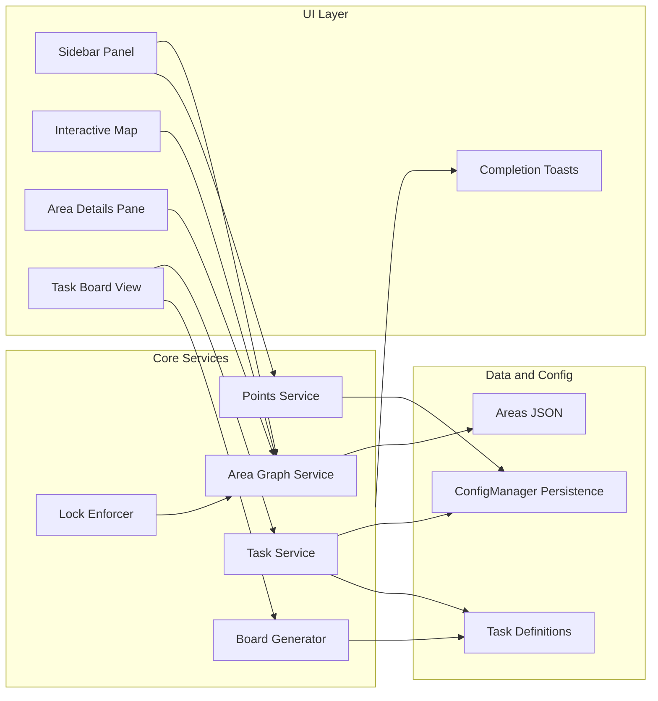

# LeagueScape RuneLite Plugin — Implementation Plan

## Current state

The repo is a standard RuneLite Plugin Hub scaffold: [ExamplePlugin.java](src/main/java/com/example/ExamplePlugin.java), [ExampleConfig.java](src/main/java/com/example/ExampleConfig.java), [build.gradle](build.gradle) (Java 11, `net.runelite:client`), and [runelite-plugin.properties](runelite-plugin.properties). This will be renamed and extended into the LeagueScape plugin.

---

## Architecture overview

- **Plugin entry**: Single plugin class (e.g. `LeagueScapePlugin`) with `@PluginDescriptor`, providing config and registering overlays/panels.
- **Enforcement**: Subscribe to `MenuOptionClicked`; resolve target to `WorldPoint` (or region); if not in unlocked set, call `event.consume()` and show “Locked area” feedback (no menu entry removal; Jagex-safe).
- **Persistence**: Use RuneLite `ConfigManager` (and optionally `ConfigDescriptor` for complex state) to store: starting area, points earned/spent, unlocked area IDs, task board seed and node states, setup options. All per-account or per-profile as appropriate.
- **Map**: Prefer RuneLite’s existing World Map as base; add a **WorldMapOverlay** (or equivalent) to draw polygon zones and handle hover/click. Alternative: custom panel with a simplified map if overlay integration is too limited.

---

## Data model (foundation for all MVPs)

- **Areas** (e.g. `src/main/resources/areas.json`): For each area: `id`, `displayName`, `polygon` (list of `WorldPoint` or `{x,y,plane}`), `includes[]` (region IDs or area IDs for dungeons/interiors), `neighbors[]` (adjacent area IDs), `unlockCost` (points). Load via `Class.getResourceAsStream()` (Plugin Hub–safe).
- **Region containment**: Derive region ID from `WorldPoint`: `regionId = (x >> 6) << 8 | (y >> 6)`. An area’s “unlocked” set = all region IDs in its polygon plus `includes[]`. Player is “in unlocked space” if their current `WorldPoint` (and instance-adjusted) maps to one of the unlocked region IDs (or point-in-polygon if you store polygons).
- **Task definition** (e.g. `tasks.json` or code-first): `id`, `title`, `description`, `areaScope` (area IDs or global), `difficultyTier`, `pointsReward`, `requirements` (skill floors, quest state, areas), `completionCheck` (type: skill_delta / quest / varbit / item / manual), `wikiLink`. Scale by “Player Power Band” (total level, combat level, unlocked count, tasks completed).
- **Board state** (persisted): Seed (from account + start time + ruleset), grid `(x,y)` → task id + status (hidden / revealed / completed / blocked). Start at `(0,0)`; completing a node reveals 4 orthogonal neighbors; difficulty by Manhattan distance from `(0,0)`.

---

## MVP-1: Core progression

**Goal**: Area graph, polygon-based lock, points earn/spend, map hover/click, area details pane.

1. **Rename and wire plugin**
  - Rename package from `com.example` to `com.leaguescape` (or your choice). Update [build.gradle](build.gradle) `pluginMainClass`, [runelite-plugin.properties](runelite-plugin.properties) (displayName, description, tags, plugins), and plugin class `@PluginDescriptor` to “Leaguescape”.
  - Add [LeagueScapeConfig](src/main/java/com/example/ExampleConfig.java): starting area (dropdown + “pick on map” later), starting points, difficulty multiplier, “Area completion required”, “Strict lock level”, “Sailing/ocean nodes” (optional). All persisted via `ConfigManager`.
2. **Area graph and lock service**
  - **AreaGraphService**: Load areas from JSON; build in-memory graph (neighbors, costs). Expose `Set<String> getUnlockedAreaIds()`, `boolean isWorldPointUnlocked(WorldPoint)`, `List<Area> getUnlockableNeighbors()`, `int getCost(String areaId)`.
  - **Unlocked set**: Persist unlocked area IDs in config; on startup, apply “one chunk style” so unlocking an area unlocks its polygon regions + `includes[]` (dungeons, upstairs). Use region IDs for fast “is tile allowed” checks; optionally point-in-polygon for exact boundaries.
  - **LockEnforcer** (in plugin):
    - Subscribe to **MenuOptionClicked**. Resolve clicked target to a tile/WorldPoint (using event params or `MenuEntry` + client: e.g. `Widget` for spells, or scene for tile actions). If the target tile/region is not in the unlocked set, call `event.consume()` and trigger “Locked area” feedback (e.g. `client.addChatMessage(ChatMessageType.GAMEMESSAGE, "", "Locked area.", null)` or a small overlay).
    - On **GameTick**: get local player `WorldPoint` (from `LocalPoint` + `WorldPoint.fromLocal(client, local)` or instance variant). If not in unlocked set: set “boundary breach” flag, show persistent overlay banner (“You are in a locked area — return to resume.”), and disable point earning and task completion until back in unlocked space. No logout.
  - **Teleports**: Maintain a mapping of teleport actions (spell IDs, item “Rub”/use) → destination `WorldPoint`(s). In `MenuOptionClicked`, if the option is a known teleport and its destination is locked, `event.consume()` and show “Destination locked.” Same for POH portals if destination is known.
3. **Points service**
  - **PointsService**: `getEarnedTotal()`, `getSpendable()`, `addEarned(int)`, `spend(int)` (for unlocks). Persist earned total and spent total (or spendable) in config so points are stable across sessions.
4. **Sidebar panel (“Leaguescape”)**
  - **PluginPanel** (Swing): Current area name, points (earned total / spendable), list of “Next unlock” (adjacent, affordable), buttons: World Map, Task Board, Rules & Setup. “Rules & Setup” can open a config panel or a custom dialog for starting area, starting points, difficulty, toggles.
5. **Interactive map**
  - **WorldMapOverlay** (or client’s world map overlay API): Draw polygons per area (unlocked = one style, locked = another). On hover: show name, locked/unlocked, point cost, prerequisites (e.g. “Requires: Varrock”). On click: open **Area Details Pane**.
  - **Area Details Pane**: Can be a second panel or a modal/dialog: area summary, cost to unlock, list of adjacent areas (locked/unlocked), “Open Task Board” (global or area-filtered when implemented in MVP-2).
6. **Setup flow**
  - On first run (or when “not configured”): prompt to choose starting area (dropdown or map click), starting points, and rule toggles. Save to config. Initialize unlocked set = { starting area } and its `includes[]`.

**Deliverables**: Walking and interacting into locked areas blocked; teleports to locked areas blocked; points displayed and spendable for unlocks; map with hover/click and area details; persistent state.

---

## MVP-2: Task board

**Goal**: Reveal-as-you-go task board, difficulty bands by distance, skill/quest task types with auto-detect where possible and manual confirm fallback.

1. **Task definitions and scaling**
  - Define task pool (JSON or code): skill-gain, quest-complete, diary, collection-log style. Each task has `areaScope`, `difficultyTier`, `pointsReward`, requirements, and `completionCheck` type.
  - **Player Power Band**: Compute from `Skill.getTotalLevel()`, combat level, unlocked area count, completed task count. Filter tasks that are feasible (requirements + regions) and match difficulty band.
2. **Board generator**
  - **BoardGenerator**: Seed = hash(account name + start timestamp + ruleset). Grid (x,y); d = |x| + |y|. d 1–2 → Easy, 3–4 → Medium, 5–6 → Hard, d ≥ 7 → Elite. On “reveal” of a node, pick a random task from the eligible pool (not already used, and ensure at least one path forward). Persist board state (node → task id + status) in config.
3. **Task completion detectors**
  - **StatChanged**: For “Gain X levels in Y skill” tasks, compare before/after or use current level vs required.
  - **VarbitChanged** / quest state: For “Complete quest A”, use known varbits/varplayers for quest completion.
  - **ItemContainerChanged** (e.g. inventory/bank): For “Obtain item” or collection log–style (if exposed by API).
  - **Manual confirm**: Config or panel button “Mark complete” for tasks that can’t be auto-detected.
  - When a task is completed: add points via **PointsService**, update board state to “completed”, reveal 4 orthogonal neighbors (assign tasks via BoardGenerator), fire completion feedback (MVP-3 toasts).
4. **Task board UI**
  - **Task Board View** (panel or overlay): Node-based grid; center = (0,0) (starter, auto-revealed/completed). Each node: icon, short label, points reward, status (hidden / revealed / completed / blocked). Orthogonal layout; difficulty increases with Manhattan distance. “Area completion required” option: grey out or hide unlock buttons until all revealed tasks in current area scope are completed (or threshold).
5. **Unlock flow**
  - When user spends points to unlock an area (from sidebar or Area Details): deduct points, add area to unlocked set, persist, show “Area Unlocked” feedback (toast in MVP-3).

**Deliverables**: Board that reveals on completion; difficulty ramp; at least skill and quest completion detection; points awarded on complete; optional “area completion required” gating.

---

## MVP-3: Polish and Raging Echoes styling

**Goal**: Leagues V: Raging Echoes–inspired visuals, collection-log–style toasts, export/import.

1. **Visual direction**
  - Reference Raging Echoes combat mastery grid: panels, iconography, “tree” feel. Apply to Task Board (node borders, colors by difficulty, subtle background) and Sidebar panel (panel style, typography).
  - Reuse RuneLite theming where possible; avoid hardcoded colors that break dark mode (per Mermaid/style guidelines).
2. **Completion / unlock feedback**
  - **Collection-log-style popup**: Small overlay or panel that appears briefly on task complete: icon + “Task Complete” + points earned + “Open board” (or “View task”). On area unlock: icon + “Area Unlocked” + points spent + “Open map”. Implement as a transient **Overlay** (positioned like a toast) or a small **PluginPanel** that auto-hides after a few seconds. No dependency on in-game collection log widget; mimic the pattern only.
3. **Export / import**
  - **Export**: Serialize run seed, ruleset (starting area, points, difficulty, toggles), and optionally board state + unlock state to a string (e.g. base64 JSON) for sharing or backup. **Import**: Parse and restore config/state (with sanity checks). Expose via “Rules & Setup” or a separate panel button.
4. **Locked items (optional, config default OFF)**
  - **§6.4**: Only items whose *use target* is a locked area (e.g. teleport jewelry, spellbook). When “Use” is clicked on such an item, resolve destination; if locked, consume and show “Destination locked.” Option (config): items whose *source* content is locked — default OFF due to false positive risk.

**Deliverables**: Cohesive Raging Echoes–inspired UI; toasts for task complete and area unlock; export/import run seed and rules; optional locked-item rule.

---

## RuneLite and Plugin Hub alignment

- **API usage**: Use only public RuneLite API and client APIs (no reflection into internals). Rely on [runelite-api](https://static.runelite.net/runelite-api/apidocs/) and [runelite-client](https://static.runelite.net/runelite-client/apidocs/) Javadocs and existing core/hub plugins for patterns.
- **Jagex rules**: Do not remove or reorder menu entries (no Menu Entry Swapper–style behavior). Only **consume** `MenuOptionClicked` to block invalid actions (locked area / locked teleport). No automation; all progression is player-driven.
- **Resources**: Bundled JSON and images in `src/main/resources`; load with `getResourceAsStream()`.
- **Dependencies**: Prefer no extra third-party JARs (Plugin Hub verification burden). Use RuneLite’s Lombok and client only.
- **Submission**: When ready, fork [plugin-hub](https://github.com/runelite/plugin-hub), add `plugins/<name>` with `repository=` and `commit=`, open PR. Ensure `runelite-plugin.properties` and `displayName`/description/tags are correct; add `icon.png` if desired (max 48×72 px).

---

## Suggested package and file layout

- `com.leaguescape` — `LeagueScapePlugin`, `LeagueScapeConfig`
- `com.leaguescape.area` — `Area`, `AreaGraphService`, area loading
- `com.leaguescape.lock` — `LockEnforcer`, region/tile checks, teleport map
- `com.leaguescape.points` — `PointsService`
- `com.leaguescape.task` — task definition, `TaskService`, completion detectors, `BoardGenerator`
- `com.leaguescape.ui` — sidebar panel, world map overlay, area details pane, task board panel, toast overlay
- `com.leaguescape.data` — DTOs for areas/tasks; persistence keys
- Resources: `areas.json`, `tasks.json` (or split by region), and any Raging Echoes–style assets (icons, panel backgrounds) in `src/main/resources`.

---

## Risk and notes

- **Menu target resolution**: Mapping every menu action to a `WorldPoint` is non-trivial (e.g. “Walk here” vs “Use X on Y”). Start with the most important: “Walk here”, object/NPC interactions (from scene), and known teleport widgets/items. Expand as needed.
- **Instance handling**: Use `WorldPoint.fromLocalInstance(client, local)` when in instances so “unlocked” checks use instance region mapping where applicable.
- **Sailing/ocean nodes**: Add area nodes and edges for ocean regions when Sailing is in game; gate behind config so the plugin still works without Sailing.
- **Death**: Spec allows player to return to any unlocked area; plugin does not auto-path. Only enforce: no earning/completion in locked space, and show breach banner until they are back.

This plan keeps your spec’s hard lock (no logout), branching unlock graph, points-as-currency, reveal-as-you-go board, and Raging Echoes styling within RuneLite’s API and Plugin Hub constraints.