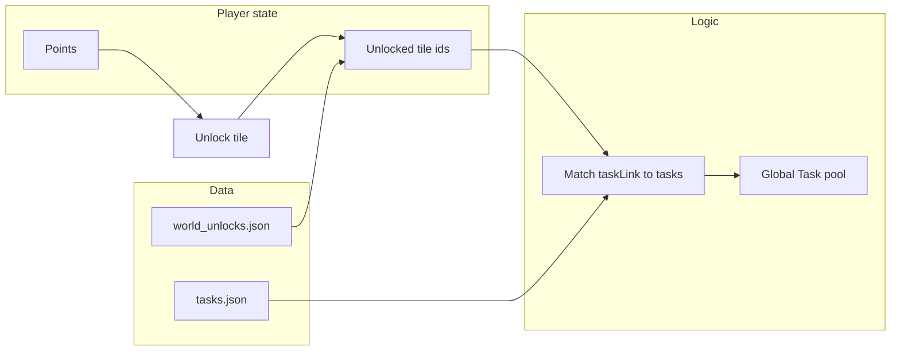

# World Unlock Game Mode Plan

This document defines the **World Unlock** game mode: a progression system where the player spends points to unlock tiles from a global grid. Each unlocked tile adds linked tasks to the **Global Task** pool. The design is data-driven from `world_unlocks.json` and related resources.

---

## 1. Overview

### 1.1 Goal

- **Unlock grid:** A single list of tiles (areas, skills, quests, bosses, achievement diary tiers) that the player can unlock by spending points.
- **Task linking:** When a tile is unlocked, all tasks that match its `taskLink` are added to the player’s Global Task panel.
- **Progression:** Tiles have prerequisites (other tiles or area ids) and a point cost by tier. The player starts with a subset of tiles available and expands the task pool by unlocking more tiles.

### 1.2 Relation to Current Modes

The existing plugin uses:

- **UnlockMode:** `POINT_BUY` or `POINTS_TO_COMPLETE` (area-only unlocking from `areas.json`).
- **Task grid:** Per-area task grids from `tasks.json`, filtered by unlocked area ids.

The **World Unlock** mode is the mode where:

- The unlock set is defined by **`world_unlocks.json`** (not only areas from `areas.json`).
- A **Global Task** panel is built by collecting all tasks that match the `taskLink` of every unlocked tile.
- Optionally, the map/UI can still use `areas.json` for geography while the “what can I do” list comes from world unlocks.

---

## 2. Data Sources

| Resource | Purpose |
|----------|---------|
| **world_unlocks.json** | Canonical list of unlock tiles: type, id, displayName, tier, cost, prerequisites, taskLink. |
| **tasks.json** | Task definitions (displayName, taskType, difficulty, area, requirements). Tasks are matched to tiles via taskLink. |
| **areas.json** | Area polygons and metadata; used for map and for area-based prerequisites. |
| **quest_tiles.json** | Reference list of quest tiles (mirrors quest unlocks in world_unlocks). Source: Quests_and_Miniquests. |
| **boss_tiles.json** | Reference list of bosses with requirements and collection log; boss unlock tiles in world_unlocks reference these. |

---

## 3. Unlock Tile Types and Counts

All tiles live in `world_unlocks.json` under `unlocks`. Each tile has: `type`, `id`, `displayName`, `tier`, `cost`, `prerequisites`, `taskLink`.

| Type | Approx. count | Description |
|------|----------------|-------------|
| **area** | 4 | Starting regions (e.g. Lumbridge, Draynor, Al Kharid, Varrock). Unlocking adds all tasks whose `area`/`areas` contains this tile id. |
| **skill** | 180 | 18 skills × 10 level bands (1–10, 11–20, …, 91–99). Unlocking adds tasks for that skill and level band; tier from band. |
| **quest** | 170 | One tile per quest/miniquest. Tier from difficulty (Novice→1 … Grandmaster→5, Special→3). |
| **boss** | 70+ | One tile per OSRS boss (world, wilderness, instanced, DT2, sporadic, slayer, minigame, skilling, raids). Tier from combat level. |
| **achievement_diary** | 48 | 12 diaries × 4 tiers (Easy/Medium/Hard/Elite). Unlocking adds diary tasks for that region and difficulty. |

**Cost by tier:** 1 → 25, 2 → 50, 3 → 75, 4 → 100, 5 → 125 (skills/quests/bosses/diaries use this where applicable; areas may use 0 for starting).

---

## 4. taskLink Types and Task Matching

When a tile is unlocked, the client (or server) finds all tasks in `tasks.json` that match the tile’s `taskLink`. Matching rules:

### 4.1 area

- **taskLink:** `{ "type": "area" }`
- **Match:** Task’s `area` or `areas` contains the tile’s `id`.
- **Note:** Tile `id` must equal an area id (e.g. `lumbridge`, `varrock`).

### 4.2 skill

- **taskLink:** `{ "type": "skill", "skillName": "<Agility|Mining|...>", "levelMin": n, "levelMax": m }`
- **Match:** `taskType === skillName` and task’s difficulty corresponds to the level band (1–39→tier 1, 40–59→tier 2, 60–79→tier 3, 80–89→tier 4, 90–99→tier 5). Only include tasks whose area (if any) is in the set of unlocked area ids.
- **Tier:** From level band (e.g. 1–10, 11–20, 21–30, 31–40 → tier 1; 41–50, 51–60 → tier 2; etc.).

### 4.3 quest (taskFilter)

- **taskLink:** `{ "type": "taskFilter", "taskType": "Quest", "requirementsContains": "<quest name>" }`
- **Match:** `taskType === "Quest"` and (task’s `displayName` or `requirements` or quest identifier) contains `requirementsContains`.
- **Tier:** From quest difficulty (Novice=1, Intermediate=2, Experienced=3, Master=4, Grandmaster=5, Special=3).

### 4.4 taskFilter (generic)

- **taskLink:** `{ "type": "taskFilter", "taskType": "<string>", "requirementsContains": "<string>", "difficulty": <1–5 optional> }`
- **Match:** `taskType` equals and (displayName/requirements/area) contains `requirementsContains`. If `difficulty` is present, also require `task.difficulty === taskLink.difficulty`.
- **Used by:** Achievement diary tier tiles (with `difficulty`), and any custom tiles.

### 4.5 boss (taskFilter)

- **taskLink:** `{ "type": "taskFilter", "taskType": "Boss", "requirementsContains": "<boss displayName>" }`
- **Match:** `taskType === "Boss"` and task references the boss (e.g. displayName or requirements contains boss name).
- **Tier:** From boss combat level in `boss_tiles.json` (1–200→1, 201–400→2, 401–600→3, 601–800→4, 801+→5).

### 4.6 achievement_diary (taskFilter + difficulty)

- **taskLink:** `{ "type": "taskFilter", "taskType": "Achievement Diary", "requirementsContains": "<diary substring>", "difficulty": 1|2|3|4 }`
- **Match:** `taskType === "Achievement Diary"`, task matches diary (e.g. displayName/area contains `requirementsContains`), and if `difficulty` is present, `task.difficulty === taskLink.difficulty` (Easy=1, Medium=2, Hard=3, Elite=4).
- **Tier:** 1–4 (Easy–Elite). Cost 25/50/75/100.

### 4.7 taskDisplayNames (explicit)

- **taskLink:** `{ "type": "taskDisplayNames", "taskDisplayNames": [ "Task A", "Task B" ] }`
- **Match:** Task’s `displayName` is in the given array.
- **Use:** When a tile should expose a fixed list of tasks by name.

---

## 5. Progression Model

### 5.1 Prerequisites

- **prerequisites:** Array of tile `id`s and/or area `id`s. All must be unlocked before this tile can be purchased.
- **Examples:**
  - Area tile: `prerequisites: ["lumbridge"]`
  - Skill band: `prerequisites: ["agility_1_10"]` for next band
  - Quest: `prerequisites: []` or required quest ids
  - Boss: `prerequisites: []` (or quest/area if desired)
  - Achievement diary Medium: `prerequisites: ["lumbridge_draynor_easy"]`

### 5.2 Starting State

- At least the starting area(s) are unlocked (e.g. Lumbridge, or a configurable subset of area tiles with no/zero cost).
- No points required for starting areas; other tiles have `cost` in points.

### 5.3 Unlock Flow

1. Compute **unlockable** tiles: those whose `prerequisites` are all in the current unlocked set and whose cost is affordable.
2. Player spends points to unlock a tile; its `id` is added to the unlocked set.
3. **Global Task pool:** For every unlocked tile, collect all tasks from `tasks.json` that match its `taskLink`. Union into one pool (optionally deduplicated by task key).
4. Optionally: task grid per area can remain for map UX, while “Global Task” panel shows the union of all taskLink-matched tasks.

---

## 6. Reference: Diaries and Bosses

### 6.1 Achievement diary (12 × 4 tiers)

| Diary | requirementsContains | Easy prerequisites |
|-------|----------------------|--------------------|
| Lumbridge & Draynor | Lumbridge | lumbridge, draynor |
| Varrock | Varrock | varrock |
| Desert | Al Kharid | al_kharid |
| Falador, Fremennik, Kandarin, Karamja, Kourend & Kebos, Morytania, Western Provinces, Wilderness, Ardougne | Falador / Fremennik / … / Ardougne | [] (or future area ids) |

Medium/Hard/Elite prerequisites are the previous tier’s tile id (e.g. `varrock_medium` requires `varrock_easy`).

### 6.2 Boss tiles

- **boss_tiles.json** holds: id, displayName, level, hitpoints, location, requirements, collectionLogItems, tier.
- **world_unlocks.json** has one boss tile per boss with `taskLink.requirementsContains` = boss displayName; cost by tier (25–125).

---

## 7. Implementation Status

| Component | Status |
|-----------|--------|
| **world_unlocks.json** | Done. Schema and all tile types (area, skill, quest, boss, achievement_diary) with taskLink and costs. |
| **quest_tiles.json** | Done. Standalone list of quest tiles; quest unlocks also embedded in world_unlocks. |
| **boss_tiles.json** | Done. Boss list with requirements and collection log; boss unlocks in world_unlocks. |
| **tasks.json** | Done. Tasks have taskType, difficulty, area, requirements. |
| **Load world_unlocks in Java** | Not implemented. Current code uses areas.json and UnlockMode for area-only unlocking. |
| **Global Task panel from taskLink** | Not implemented. When a tile is unlocked, no code yet collects tasks matching taskLink. |
| **Difficulty filter in taskLink** | Not implemented. Optional `taskLink.difficulty` is in data for diary tiers; filtering by it would require taskLink evaluation in code. |

### 7.1 Unlock flow (conceptual)

To run **World Unlock** mode end-to-end:

1. Load `world_unlocks.json` and persist unlocked tile ids (e.g. config key `unlockedWorldTiles`).
2. Implement taskLink matching: for each unlocked tile, compute the set of tasks from `tasks.json` that match its taskLink (including optional `difficulty` for achievement_diary).
3. Expose the union of those tasks in a Global Task panel (or merge into existing task UI).
4. Add a World Unlock UI: list or grid of tiles, show unlockable and cost, and an “Unlock” action that spends points and adds the tile id to the unlocked set.

---

## 8. File Reference

- **src/main/resources/world_unlocks.json** – Unlock grid definition and `_schema`.
- **src/main/resources/tasks.json** – Task definitions.
- **src/main/resources/areas.json** – Area polygons and metadata.
- **src/main/resources/quest_tiles.json** – Quest tile reference.
- **src/main/resources/boss_tiles.json** – Boss reference (requirements, collection log).
- **LeagueScapeConfig.UnlockMode** – Current area-only modes (POINT_BUY, POINTS_TO_COMPLETE).

This plan defines the **World Unlock** game mode so that implementation can follow a single, consistent design.
